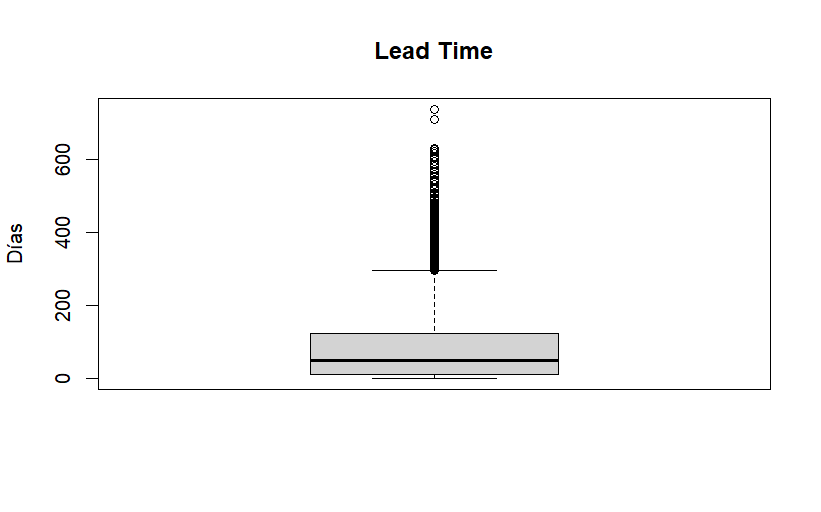
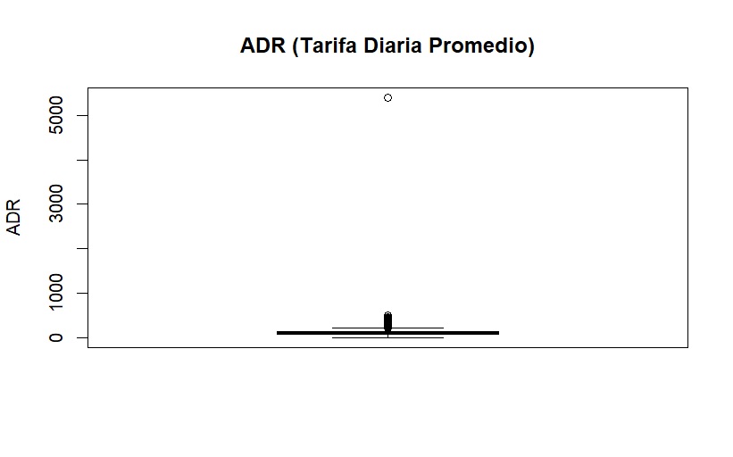
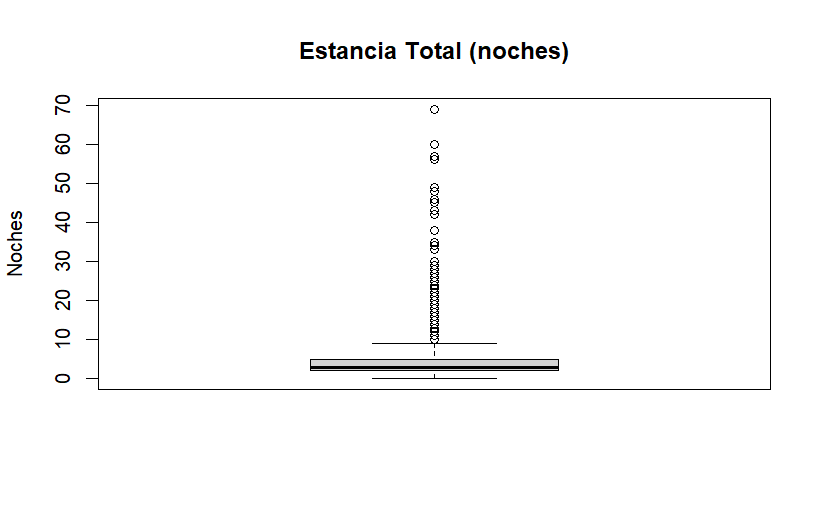
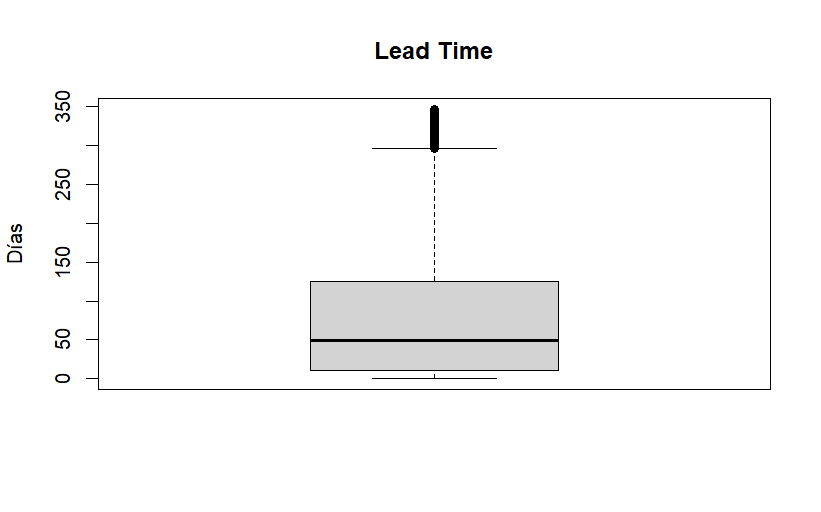
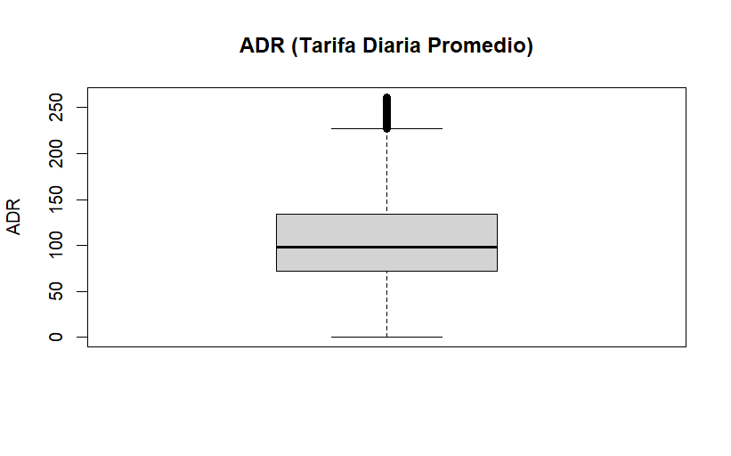

# Trabajo1-FUNDAMENTOSDEDATASCIENCE


Estudiantes: 
- u202311021 Saavedra Cervera Sergio Andres
- u          David Angelo Zavala Arteaga
- u202014659 Martin Alonso Del Aguila Arevalo


## **Contenidos**


### **1. CASO DE ESTUDIO**

#### **Origen de los datos**

Los datos que usaremos provienen de una base de datos llamada [Hotel booking demand dataset](https://www.sciencedirect.com/science/article/pii/S2352340918315191) que contiene información relacionada a reservas de hoteles donde nos dan datos cómo la fecha de reserva, la duración de estadía, la cantidad de espacio de estacionamientos posibles, entre otros datos. 

Estos datos fueron escritos por Nuno Antonio, Ana Almeida y Luis Nunes en Febrero del 2019 y recolectaron estos datos de base de datos SQL de hoteles respecto al Sistema de Manejo de Propiedades. (Property Management System).

Para este trabajo se usará una versión modificada de esta base de datos donde se incorporó ruido a los datos lo que provoca que haya datos faltantes  y atípicos.


#### **Casos de uso aplicable**

- ¿Quién podría estar interesado en este análisis?

   Los usuarios que pueden estar interesados en este análisis son dos:
  - Los gerentes de hoteles, los cuales podrán observar el número de clientes que lleguen a tener estos a comparación de los suyos.
  - Usuarios que estén creando una página web que promocione hoteles, los cuales podrán determinar que hoteles son los que tienen más clientes y; a partir de eso, promocionarlos en la página para que más familias vayan ahí. 


- ¿Qué problemas o necesidades responde este análisis?

Este análisis responde problemas o necesidades como:
- Cuando se realizan más reservas.
- Que tipo de hotel recibe más clientes.
- Cuáles son los patrones de ocupación, etc.
- Cuáles son los ADR de cada reserva.

### **2. CONJUNTO DE DATOS(DATASET)**

#### Descripción del dataset

```r


df <- read.csv("hotel_bookings.csv") # asignando al data frame el contenido del archivo csv

colnames(df) # Ver el nombre de las columnas
sapply(df) # Ver el tipo de cada variable

```


| Variable | Tipo | Descripción |
|---|---|---|
| hotel | character | Tipo de hotel reservado |
| is_canceled | integer | Indica si la reserva fue cancelada (1 = sí, 0 = no) |
| lead_time | integer | Número de días entre la reserva y la llegada |
| arrival_date_year | integer | Año de llegada |
| arrival_date_month | character | Mes de llegada |
| arrival_date_week_number | integer | Número de semana del año de llegada |
| arrival_date_day_of_month | integer | Día del mes de llegada |
| stays_in_weekend_nights | integer | Número de noches de fin de semana |
| stays_in_week_nights | integer | Número de noches entre semana |
| adults | integer | Número de adultos |
| children | integer | Número de niños |
| babies | integer | Número de bebés |
| meal | character | Tipo de comida reservada |
| country | character | País de procedencia del cliente |
| market_segment | character | Segmento de mercado |
| distribution_channel | character | Canal de distribución de la reserva |
| is_repeated_guest | integer | Indica si el cliente es recurrente |
| previous_cancellations | integer | Número de cancelaciones previas |
| previous_bookings_not_canceled | integer | Número de reservas previas no canceladas |
| reserved_room_type | character | Tipo de habitación reservada |
| assigned_room_type | character | Tipo de habitación asignada |
| booking_changes | integer | Número de cambios realizados en la reserva |
| deposit_type | character | Tipo de depósito realizado |
| agent | character | Código del agente de reservas |
| company | character | Código de la empresa asociada |
| days_in_waiting_list | integer | Días en lista de espera |
| customer_type | character | Tipo de cliente |
| adr | numeric | Tarifa diaria promedio |
| required_car_parking_spaces | integer | Espacios de estacionamiento requeridos |
| total_of_special_requests | integer | Número total de solicitudes especiales |
| reservation_status | character | Estado final de la reserva |
| reservation_status_date | character | Fecha del estado final de la reserva |


### **3. ANÁLISIS EXPLORATORIO DE DATOS(EDA)**

#### Cargar Datos
```r
library(readr)

df <- read_csv("hotel_bookings.csv") # Versiones modernas de RStudio tienen un comando para leer csv llamado "read_csv" lo cual evita que los datos tipo string no se convieran en tipo factores
head(df) # Observar las 6 primeras filas de la tabla
colnames(df) # Ver el nombre de las columnas del data frame
sapply(df,class) # Ver el tipo de cada variable
str(df) # Ver la estructura del dataset
```
# Hotel Bookings Dataset

| hotel | is_canceled | lead_time | arrival_date_year | arrival_date_month | stays_in_weekend_nights | stays_in_week_nights | adults | children | babies | meal | country | market_segment | distribution_channel | is_repeated_guest | previous_cancellations | previous_bookings_not_canceled | reserved_room_type | assigned_room_type | booking_changes | deposit_type | agent | company | days_in_waiting_list | customer_type | adr | required_car_parking_spaces | total_of_special_requests | reservation_status | reservation_status_date |
|---|---|---|---|---|---|---|---|---|---|---|---|---|---|---|---|---|---|---|---|---|---|---|---|---|---|---|---|---|---|
| Resort Hotel | 0 | 342 | 2015 | July | 0 | 0 | 2 | 0 | 0 | BB | PRT | Direct | Direct | 0 | 0 | 0 | C | C | 3 | No Deposit | NULL | NULL | 0 | Transient | 0.0 | 0 | 0 | Check-Out | 2015-07-01 |
| Resort Hotel | 0 | 737 | 2015 | July | 0 | 0 | 2 | 0 | 0 | BB | PRT | Direct | Direct | 0 | 0 | 0 | C | C | 4 | No Deposit | NULL | NULL | 0 | Transient | 0.0 | 0 | 0 | Check-Out | 2015-07-01 |
| Resort Hotel | 0 | 7 | 2015 | July | 0 | 1 | 1 | 0 | 0 | BB | GBR | Direct | Direct | 0 | 0 | 0 | A | C | 0 | No Deposit | NULL | NULL | 0 | Transient | 75.0 | 0 | 0 | Check-Out | 2015-07-02 |
| Resort Hotel | 0 | 13 | 2015 | July | 0 | 1 | 1 | 0 | 0 | BB | GBR | Corporate | Corporate | 0 | 0 | 0 | A | A | 0 | No Deposit | 304 | NULL | 0 | Transient | 75.0 | 0 | 0 | Check-Out | 2015-07-02 |
| Resort Hotel | 0 | 14 | 2015 | July | 0 | 2 | 2 | 0 | 0 | BB | GBR | Online TA | TA/TO | 0 | 0 | 0 | A | A | 0 | No Deposit | 240 | NULL | 0 | Transient | 98.0 | 0 | 1 | Check-Out | 2015-07-03 |


#### Inspeccionar datos
```r
#Nombre de columnas

 [1] "hotel"                          "is_canceled"                   
 [3] "lead_time"                      "arrival_date_year"             
 [5] "arrival_date_month"             "arrival_date_week_number"      
 [7] "arrival_date_day_of_month"      "stays_in_weekend_nights"       
 [9] "stays_in_week_nights"           "adults"                        
[11] "children"                       "babies"                        
[13] "meal"                           "country"                       
[15] "market_segment"                 "distribution_channel"          
[17] "is_repeated_guest"              "previous_cancellations"        
[19] "previous_bookings_not_canceled" "reserved_room_type"            
[21] "assigned_room_type"             "booking_changes"               
[23] "deposit_type"                   "agent"                         
[25] "company"                        "days_in_waiting_list"          
[27] "customer_type"                  "adr"                           
[29] "required_car_parking_spaces"    "total_of_special_requests"     
[31] "reservation_status"             "reservation_status_date"       


#Tipo de cada variable

                         hotel                    is_canceled                      lead_time 
                   "character"                      "numeric"                      "numeric" 
             arrival_date_year             arrival_date_month       arrival_date_week_number 
                     "numeric"                    "character"                      "numeric" 
     arrival_date_day_of_month        stays_in_weekend_nights           stays_in_week_nights 
                     "numeric"                      "numeric"                      "numeric" 
                        adults                       children                         babies 
                     "numeric"                      "numeric"                      "numeric" 
                          meal                        country                 market_segment 
                   "character"                    "character"                    "character" 
          distribution_channel              is_repeated_guest         previous_cancellations 
                   "character"                      "numeric"                      "numeric" 
previous_bookings_not_canceled             reserved_room_type             assigned_room_type 
                     "numeric"                    "character"                    "character" 
               booking_changes                   deposit_type                          agent 
                     "numeric"                    "character"                    "character" 
                       company           days_in_waiting_list                  customer_type 
                   "character"                      "numeric"                    "character" 
                           adr    required_car_parking_spaces      total_of_special_requests 
                     "numeric"                      "numeric"                      "numeric" 
            reservation_status        reservation_status_date 
                   "character"                         "Date" 

#Estructura del dataset

tibble [119,390 × 35] (S3: tbl_df/tbl/data.frame)
 $ hotel                         : Factor w/ 2 levels "City Hotel","Resort Hotel": 2 2 2 2 2 2 2 2 2 2 ...
 $ is_canceled                   : num [1:119390] 0 0 0 0 0 0 0 0 1 1 ...
 $ lead_time                     : num [1:119390] 342 737 7 13 14 14 0 9 85 75 ...
 $ arrival_date_year             : num [1:119390] 2015 2015 2015 2015 2015 ...
 $ arrival_date_month            : chr [1:119390] "July" "July" "July" "July" ...
 $ arrival_date_week_number      : num [1:119390] 27 27 27 27 27 27 27 27 27 27 ...
 $ arrival_date_day_of_month     : num [1:119390] 1 1 1 1 1 1 1 1 1 1 ...
 $ stays_in_weekend_nights       : num [1:119390] 0 0 0 0 0 0 0 0 0 0 ...
 $ stays_in_week_nights          : num [1:119390] 0 0 1 1 2 2 2 2 3 3 ...
 $ adults                        : num [1:119390] 2 2 1 1 2 2 2 2 2 2 ...
 $ children                      : num [1:119390] 0 0 0 0 0 0 0 0 0 0 ...
 $ babies                        : num [1:119390] 0 0 0 0 0 0 0 0 0 0 ...
 $ meal                          : Factor w/ 5 levels "BB","FB","HB",..: 1 1 1 1 1 1 1 2 1 3 ...
 $ country                       : Factor w/ 178 levels "ABW","AGO","AIA",..: 137 137 60 60 60 60 137 137 137 137 ...
 $ market_segment                : Factor w/ 8 levels "Aviation","Complementary",..: 4 4 4 3 7 7 4 4 7 6 ...
 $ distribution_channel          : Factor w/ 5 levels "Corporate","Direct",..: 2 2 2 1 4 4 2 2 4 4 ...
 $ is_repeated_guest             : num [1:119390] 0 0 0 0 0 0 0 0 0 0 ...
 $ previous_cancellations        : num [1:119390] 0 0 0 0 0 0 0 0 0 0 ...
 $ previous_bookings_not_canceled: num [1:119390] 0 0 0 0 0 0 0 0 0 0 ...
 $ reserved_room_type            : Factor w/ 10 levels "A","B","C","D",..: 3 3 1 1 1 1 3 3 1 4 ...
 $ assigned_room_type            : Factor w/ 12 levels "A","B","C","D",..: 3 3 3 1 1 1 3 3 1 4 ...
 $ booking_changes               : num [1:119390] 3 4 0 0 0 0 0 0 0 0 ...
 $ deposit_type                  : chr [1:119390] "No Deposit" "No Deposit" "No Deposit" "No Deposit" ...
 $ agent                         : Factor w/ 334 levels "1","10","103",..: 334 334 334 157 103 103 334 156 103 40 ...
 $ company                       : Factor w/ 353 levels "10","100","101",..: 353 353 353 353 353 353 353 353 353 353 ...
 $ days_in_waiting_list          : num [1:119390] 0 0 0 0 0 0 0 0 0 0 ...
 $ customer_type                 : Factor w/ 4 levels "Contract","Group",..: 3 3 3 3 3 3 3 3 3 3 ...
 $ adr                           : num [1:119390] 0 0 75 75 98 ...
 $ required_car_parking_spaces   : num [1:119390] 0 0 0 0 0 0 0 0 0 0 ...
 $ total_of_special_requests     : num [1:119390] 0 0 0 0 1 1 0 1 1 0 ...
 $ reservation_status            : Factor w/ 3 levels "Canceled","Check-Out",..: 2 2 2 2 2 2 2 2 1 1 ...
 $ reservation_status_date       : Date[1:119390], format: NA NA NA ...
 $ reservation_status_year       : chr [1:119390] "2015" "2015" "2015" "2015" ...
 $ reservation_status_month      : chr [1:119390] "07" "07" "07" "07" ...
 $ reservation_status_dayofmonth : chr [1:119390] "01" "01" "02" "02" ...


```

Respecto a la información que nos brinda este dataset, ninguna variable puede tener un comportamiento de "dato duplicado"; debido a que, cada valor a pesar de que se repita varias veces no representa un dato único al compararlo con otros valores.


```r

# Verificar duplicados
cat("Número de filas duplicadas:", sum(duplicated(datos)), "\n")

Número de filas duplicadas: 31994

# Eliminar duplicados si existen

datos <- datos[!duplicated(datos), ]

Número de filas duplicadas: 0


```


Para optimizar el uso de memoria que hace el dataset, se cambiará todos las variables tipo "caracter" a "factor" esto permitirá a que los datos puedan ser representados en gráficos estadísticos.


```r
# Antes de convertir a factor, reemplazar cadenas vacías y "NULL" por NA
datos[datos == "" | datos == "NULL"] <- NA


# Cambiando tipos de algunas variables

# Crear columna de fecha de llegada combinando año, mes y día
# Convertir nombres de meses en inglés a número
meses <- c("January"=1, "February"=2, "March"=3, "April"=4, "May"=5, "June"=6,
           "July"=7, "August"=8, "September"=9, "October"=10, "November"=11, "December"=12)
datos$mes_num <- meses[datos$arrival_date_month]

# Crear fecha de llegada como Date
datos$fecha_llegada <- as.Date(paste(datos$arrival_date_year,
                                     datos$mes_num,
                                     datos$arrival_date_day_of_month, sep="-"),
                               format="%Y-%m-%d")

# Crear fecha de reserva (fecha_llegada - lead_time)
datos$fecha_reserva <- datos$fecha_llegada - datos$lead_time

# Crear columna de mes de llegada como factor ordenado
datos$mes_llegada <- factor(datos$arrival_date_month,
                            levels = c("January","February","March","April","May","June",
                                       "July","August","September","October","November","December"))

# Crear columna de año-mes para análisis temporal
datos$anio_mes <- format(datos$fecha_llegada, "%Y-%m")

# Convertir variables categóricas a factor
datos$hotel <- as.factor(datos$hotel)
datos$is_canceled <- as.factor(datos$is_canceled)
datos$meal <- as.factor(datos$meal)
datos$country <- as.factor(datos$country)
datos$market_segment <- as.factor(datos$market_segment)
datos$distribution_channel <- as.factor(datos$distribution_channel)
datos$reserved_room_type <- as.factor(datos$reserved_room_type)
datos$assigned_room_type <- as.factor(datos$assigned_room_type)
datos$deposit_type <- as.factor(datos$deposit_type)
datos$customer_type <- as.factor(datos$customer_type)
datos$reservation_status <- as.factor(datos$reservation_status)

# Calcular estancia total (fin de semana + entre semana)
datos$estancia_total <- datos$stays_in_weekend_nights + datos$stays_in_week_nights


```


#### Resumir estadísticas básicas

Ya con los datos cambiados y modificados conseguimos lo siguiente:

```r

# --- Resumir Estadísticas Básicas ---
summary(datos)

hotel       is_canceled   lead_time      arrival_date_year arrival_date_month
 City Hotel  :53428   0:63371     Min.   :  0.00   Min.   :2015      Length:87396      
 Resort Hotel:33968   1:24025     1st Qu.: 11.00   1st Qu.:2016      Class :character  
                                  Median : 49.00   Median :2016      Mode  :character  
                                  Mean   : 79.89   Mean   :2016                        
                                  3rd Qu.:125.00   3rd Qu.:2017                        
                                  Max.   :737.00   Max.   :2017                        
                                                                                       
 arrival_date_week_number arrival_date_day_of_month stays_in_weekend_nights stays_in_week_nights
 Min.   : 1.00            Min.   : 1.00             Min.   : 0.000          Min.   : 0.000      
 1st Qu.:16.00            1st Qu.: 8.00             1st Qu.: 0.000          1st Qu.: 1.000      
 Median :27.00            Median :16.00             Median : 1.000          Median : 2.000      
 Mean   :26.84            Mean   :15.82             Mean   : 1.005          Mean   : 2.625      
 3rd Qu.:37.00            3rd Qu.:23.00             3rd Qu.: 2.000          3rd Qu.: 4.000      
 Max.   :53.00            Max.   :31.00             Max.   :19.000          Max.   :50.000      
                                                                                                
     adults          children           babies                meal          country     
 Min.   : 0.000   Min.   : 0.0000   Min.   : 0.00000   BB       :67978   PRT    :27453  
 1st Qu.: 2.000   1st Qu.: 0.0000   1st Qu.: 0.00000   FB       :  360   GBR    :10433  
 Median : 2.000   Median : 0.0000   Median : 0.00000   HB       : 9085   FRA    : 8837  
 Mean   : 1.876   Mean   : 0.1386   Mean   : 0.01082   SC       : 9481   ESP    : 7252  
 3rd Qu.: 2.000   3rd Qu.: 0.0000   3rd Qu.: 0.00000   Undefined:  492   DEU    : 5387  
 Max.   :55.000   Max.   :10.0000   Max.   :10.00000                     (Other):27582  
                  NA's   :4                                              NA's   :  452  
       market_segment  distribution_channel is_repeated_guest previous_cancellations
 Online TA    :51618   Corporate: 5081      Min.   :0.00000   Min.   : 0.00000      
 Offline TA/TO:13889   Direct   :12988      1st Qu.:0.00000   1st Qu.: 0.00000      
 Direct       :11804   GDS      :  181      Median :0.00000   Median : 0.00000      
 Groups       : 4942   TA/TO    :69141      Mean   :0.03908   Mean   : 0.03041      
 Corporate    : 4212   Undefined:    5      3rd Qu.:0.00000   3rd Qu.: 0.00000      
 Complementary:  702                        Max.   :1.00000   Max.   :26.00000      
 (Other)      :  229                                                                
 previous_bookings_not_canceled reserved_room_type assigned_room_type booking_changes  
 Min.   : 0.000                 A      :56552      A      :46313      Min.   : 0.0000  
 1st Qu.: 0.000                 D      :17398      D      :22432      1st Qu.: 0.0000  
 Median : 0.000                 E      : 6049      E      : 7195      Median : 0.0000  
 Mean   : 0.184                 F      : 2823      F      : 3627      Mean   : 0.2716  
 3rd Qu.: 0.000                 G      : 2052      G      : 2498      3rd Qu.: 0.0000  
 Max.   :72.000                 B      :  999      C      : 2165      Max.   :21.0000  
                                (Other): 1523      (Other): 3166                       
     deposit_type      agent             company          days_in_waiting_list
 No Deposit:86251   Length:87396       Length:87396       Min.   :  0.0000    
 Non Refund: 1038   Class :character   Class :character   1st Qu.:  0.0000    
 Refundable:  107   Mode  :character   Mode  :character   Median :  0.0000    
                                                          Mean   :  0.7496    
                                                          3rd Qu.:  0.0000    
                                                          Max.   :391.0000    
                                                                              
         customer_type        adr          required_car_parking_spaces total_of_special_requests
 Contract       : 3139   Min.   :  -6.38   Min.   :0.00000             Min.   :0.0000           
 Group          :  544   1st Qu.:  72.00   1st Qu.:0.00000             1st Qu.:0.0000           
 Transient      :71986   Median :  98.10   Median :0.00000             Median :0.0000           
 Transient-Party:11727   Mean   : 106.34   Mean   :0.08423             Mean   :0.6986           
                         3rd Qu.: 134.00   3rd Qu.:0.00000             3rd Qu.:1.0000           
                         Max.   :5400.00   Max.   :8.00000             Max.   :5.0000           
                                                                                                
 reservation_status reservation_status_date    mes_num       fecha_llegada       
 Canceled :23011    Length:87396            Min.   : 1.000   Min.   :2015-07-01  
 Check-Out:63371    Class :character        1st Qu.: 4.000   1st Qu.:2016-04-01  
 No-Show  : 1014    Mode  :character        Median : 7.000   Median :2016-09-20  
                                            Mean   : 6.476   Mean   :2016-09-15  
                                            3rd Qu.: 9.000   3rd Qu.:2017-04-01  
                                            Max.   :12.000   Max.   :2017-08-31  
                                                                                 
 fecha_reserva         mes_llegada      anio_mes         estancia_total  
 Min.   :2013-06-24   August :11257   Length:87396       Min.   : 0.000  
 1st Qu.:2016-01-19   July   :10057   Class :character   1st Qu.: 2.000  
 Median :2016-07-01   May    : 8355   Mode  :character   Median : 3.000  
 Mean   :2016-06-27   April  : 7908                      Mean   : 3.631  
 3rd Qu.:2017-01-07   June   : 7765                      3rd Qu.: 5.000  
 Max.   :2017-08-31   March  : 7513                      Max.   :69.000  
                      (Other):34541                                      


# Estadísticas específicas para variables numéricas clave
numeric_vars <- c("lead_time", "stays_in_weekend_nights", "stays_in_week_nights",
                  "adults", "children", "babies", "adr", "estancia_total")
summary(datos[, numeric_vars])

lead_time      stays_in_weekend_nights stays_in_week_nights     adults          children      
 Min.   :  0.00   Min.   : 0.000          Min.   : 0.000       Min.   : 0.000   Min.   : 0.0000  
 1st Qu.: 11.00   1st Qu.: 0.000          1st Qu.: 1.000       1st Qu.: 2.000   1st Qu.: 0.0000  
 Median : 49.00   Median : 1.000          Median : 2.000       Median : 2.000   Median : 0.0000  
 Mean   : 79.89   Mean   : 1.005          Mean   : 2.625       Mean   : 1.876   Mean   : 0.1386  
 3rd Qu.:125.00   3rd Qu.: 2.000          3rd Qu.: 4.000       3rd Qu.: 2.000   3rd Qu.: 0.0000  
 Max.   :737.00   Max.   :19.000          Max.   :50.000       Max.   :55.000   Max.   :10.0000  
                                                                                NA's   :4        
     babies              adr          estancia_total  
 Min.   : 0.00000   Min.   :  -6.38   Min.   : 0.000  
 1st Qu.: 0.00000   1st Qu.:  72.00   1st Qu.: 2.000  
 Median : 0.00000   Median :  98.10   Median : 3.000  
 Mean   : 0.01082   Mean   : 106.34   Mean   : 3.631  
 3rd Qu.: 0.00000   3rd Qu.: 134.00   3rd Qu.: 5.000  
 Max.   :10.00000   Max.   :5400.00   Max.   :69.000

```


#### Identificación de datos faltantes


```r

# children: asumimos que NA significa sin niños (0)
datos$children[is.na(datos$children)] <- 0

# agent y company: tienen muchos NA, se mantienen como están (no se usarán en análisis principales)
# Para variables numéricas con pocos NA se podría usar la mediana, pero aquí no profundizamos.


```

#### Detectar outliers

```r

# Boxplot de lead_time
boxplot(datos$lead_time, main="Lead Time", ylab="Días")


```

```
# Boxplot de adr (Average Daily Rate)
boxplot(datos$adr, main="ADR (Tarifa Diaria Promedio)", ylab="ADR")


```



```
# Boxplot de estancia_total
boxplot(datos$estancia_total, main="Estancia Total (noches)", ylab="Noches")


```


```

#### Tratamientos de Outliers


# --- Tratamiento de Outliers (Winsorización al percentil 1 y 99) ---

winsorize <- function(x, probs = c(0.01, 0.99)) {
  lim <- quantile(x, probs = probs, na.rm = TRUE)
  x[x < lim[1]] <- lim[1]
  x[x > lim[2]] <- lim[2]
  return(x)
}

datos$lead_time_w <- winsorize(datos$lead_time)
datos$adr_w <- winsorize(datos$adr)
datos$estancia_w <- winsorize(datos$estancia_total)


# --- Tratamiento manual ---

# Como queremos tratar a 2 como un valor razonable, truncamos a 2 manualmente
datos$parking_w <- pmin(datos$required_car_parking_spaces, 2)


```

#### Visualización de datos corregidos

```

# Boxplot de lead_time_w
boxplot(datos$lead_time_w, main="Lead Time", ylab="Días")

```


```
# Boxplot de adr_w (Average Daily Rate)
boxplot(datos$adr_w, main="ADR (Tarifa Diaria Promedio)", ylab="ADR")


```


```
# Boxplot de estancia_w
boxplot(datos$estancia_w, main="Estancia Total (noches)", ylab="Noches")

```


#### Visualización de datos(Según preguntas)


### **4. CONCLUSIONES**


#### Nuevo set de variables después de realizar los cambios correspondientes

| Variable | Tipo | Descripción |
|---|---|---|
| hotel | Factor (Categórica) | Tipo de hotel (Resort Hotel o City Hotel) |
| is_canceled | Factor binario | Indica si la reserva fue cancelada (1) o no (0) |
| lead_time | Integer | Número de días entre la reserva y la llegada |
| arrival_date_year | Integer | Año de llegada |
| arrival_date_month | Character | Mes de llegada |
| arrival_date_week_number | Integer | Semana del año de llegada |
| arrival_date_day_of_month | Integer | Día del mes de llegada |
| stays_in_weekend_nights | Integer | Número de noches de fin de semana |
| stays_in_week_nights | Integer | Número de noches entre semana |
| adults | Integer | Número de adultos |
| children | Integer | Número de niños |
| babies | Integer | Número de bebés |
| meal | Factor (Categórica) | Tipo de comida contratada |
| country | Factor (Categórica) | País de origen del cliente |
| market_segment | Factor (Categórica) | Segmento de mercado |
| distribution_channel | Factor (Categórica) | Canal de distribución |
| is_repeated_guest | Integer | Indica si el huésped es recurrente |
| previous_cancellations | Integer | Número de cancelaciones previas |
| previous_bookings_not_canceled | Integer | Número de reservas previas no canceladas |
| reserved_room_type | Factor (Categórica) | Tipo de habitación reservada |
| assigned_room_type | Factor (Categórica) | Tipo de habitación asignada |
| booking_changes | Integer | Número de cambios realizados en la reserva |
| deposit_type | Factor (Categórica) | Tipo de depósito realizado |
| agent | Character | Identificador de agencia de viajes |
| company | Character | Identificador de empresa |
| days_in_waiting_list | Integer | Días en lista de espera |
| customer_type | Factor (Categórica) | Tipo de cliente |
| adr | Numeric | Tarifa diaria promedio (Average Daily Rate) |
| required_car_parking_spaces | Integer | Espacios de estacionamiento requeridos |
| total_of_special_requests | Integer | Número de solicitudes especiales |
| reservation_status | Factor (Categórica) | Estado final de la reserva |
| reservation_status_date | Character | Fecha del último estado de reserva |
| mes_num | Numeric | Número correspondiente al mes de llegada |
| fecha_llegada | Date | Fecha completa de llegada |
| fecha_reserva | Date | Fecha en que se realizó la reserva |
| mes_llegada | Factor ordenado | Mes de llegada ordenado cronológicamente |
| anio_mes | Character | Año y mes de llegada en formato YYYY-MM |
| estancia_total | Numeric | Total de noches de estancia |
| lead_time_w | Numeric | Lead time corregido mediante winsorización |
| adr_w | Numeric | ADR corregido mediante winsorización |
| estancia_w | Numeric | Estancia total corregida mediante winsorización |
| parking_w | Numeric | Espacios de estacionamiento truncados a máximo 2 |
| tipo_huesped | Character | Clasificación de la reserva según incluya niños/bebés |
| parking_label | Factor (Categórica) | Etiqueta categórica de espacios de estacionamiento |


**¿Qué patrones o tendencias se observaron?**

Se encontraron diversas tendencias y patrones como:

- La mayoría de personas que iban a los hoteles eran adultos.
- La mayoría de reservas que se hicieorn NO fueron canceladas.
- Las temporadas con mayores reservas fueron durante julio y agosto.


**¿Qué recomendaciones se pueden extraer a partir de los hallazgos?**

Si bien el número de reservas no canceladas predomina sobre el número de reservas que si fueron canceladas, eso no significa que el número de este sea bajo. Por lo tanto, es importante tomar en cuenta las causas que provocaron que los clientes ya no quieran ir al hotel. También, cabe recalcar que de ser posible, ambientar los hoteles para familias para aumentar el número de niños que van a los hoteles.
